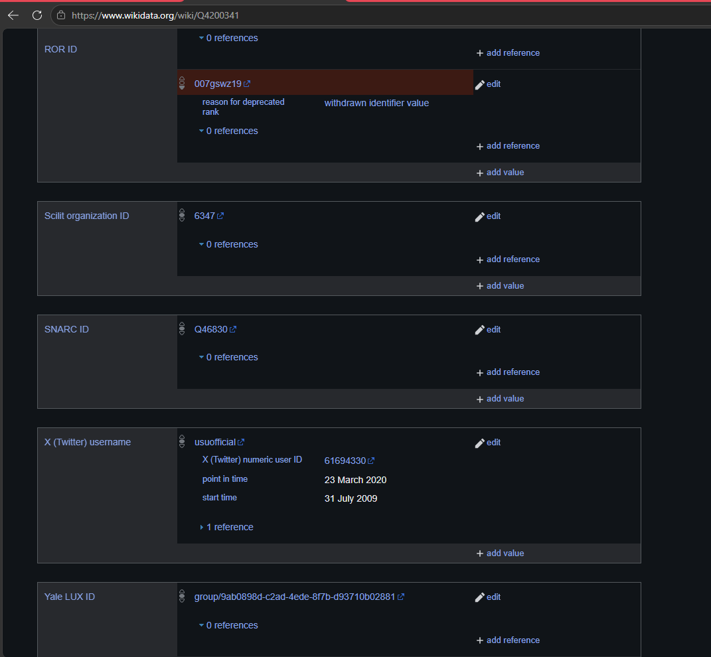

# Pertemuan 01 — Wikidata dan Knowledge Graph

## 👥 Kelompok 9

| Nama                           | NIM       | Peran           |
| ------------------------------ | --------- | --------------- |
| Rodotua Naomi Mutiara Simamora | 251402030 | Project Manager |
| Vedder Timothy Simbolon        | 251402072 | Anggota         |
| Yessica Jaklin                 | 251402001 | Anggota         |
| M. Rajadinata Nasution         | 251402107 | Anggota         |
| Daradira Vonna                 | 251402026 | Anggota         |

---

## 📚 Langkah 1 — Mencari Sebuah Entitas di Wikidata

Pada langkah ini, kami mencari sebuah entitas melalui **Wikidata**. Entitas yang dipilih adalah **Universitas Sumatera Utara (USU)**.

Wikidata merupakan basis pengetahuan terbuka yang menyimpan data terstruktur mengenai berbagai entitas di dunia. Setiap entitas memiliki identifier unik yang diawali dengan huruf **Q**, sehingga dapat dibedakan dari entitas lainnya.

### 🔎 Entitas yang Dicari

**Universitas Sumatera Utara**

Halaman entitas Wikidata:

https://www.wikidata.org/wiki/Q1377349

### 📋 Informasi Entitas

| Informasi           | Hasil                            |
| ------------------- | -------------------------------- |
| Nama entitas        | Universitas Sumatera Utara       |
| Identifier Wikidata | **Q1377349**                     |
| Negara              | Indonesia                        |
| Lokasi              | Medan, Sumatera Utara, Indonesia |
| Tahun pendirian     | 1952                             |
| Singkatan           | USU                              |
| Website resmi       | https://www.usu.ac.id/           |

### 🆔 Identifier Wikidata

Identifier Wikidata untuk **Universitas Sumatera Utara** adalah:

**Q1377349**

Identifier tersebut digunakan sebagai identitas unik entitas Universitas Sumatera Utara di dalam Wikidata. Dengan adanya identifier ini, sebuah entitas dapat dibedakan secara jelas meskipun nama entitas dapat ditulis dalam bahasa atau format yang berbeda.

### 💡 Informasi Menarik

Universitas Sumatera Utara merupakan salah satu perguruan tinggi negeri yang berada di Kota Medan, Sumatera Utara. USU menjadi salah satu institusi pendidikan tinggi yang penting di wilayah Sumatera Utara.

Dalam konteks **Web Semantik**, informasi mengenai Universitas Sumatera Utara dapat direpresentasikan dalam bentuk data terstruktur dan dihubungkan dengan entitas lain menggunakan hubungan atau *relationship* tertentu.

---

## 📸 Screenshot

Screenshot halaman Wikidata Universitas Sumatera Utara disimpan pada:

```text
pertemuan-01/screenshots/wikidata-usu.png
```



---

## 🔗 Referensi

* [Wikidata — Universitas Sumatera Utara](https://www.wikidata.org/wiki/Q1377349)
* [Website Resmi Universitas Sumatera Utara](https://www.usu.ac.id/)
