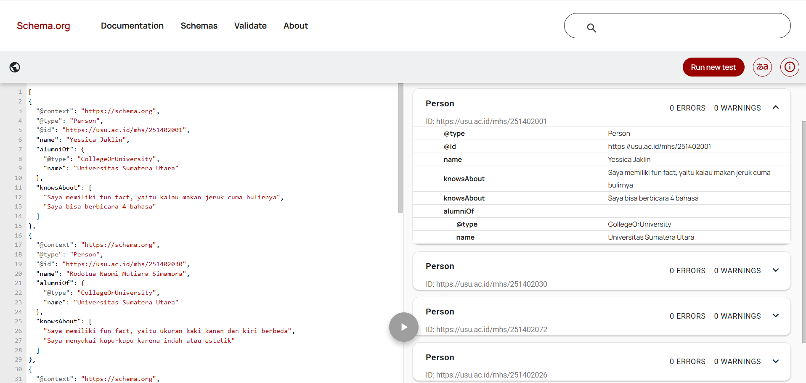
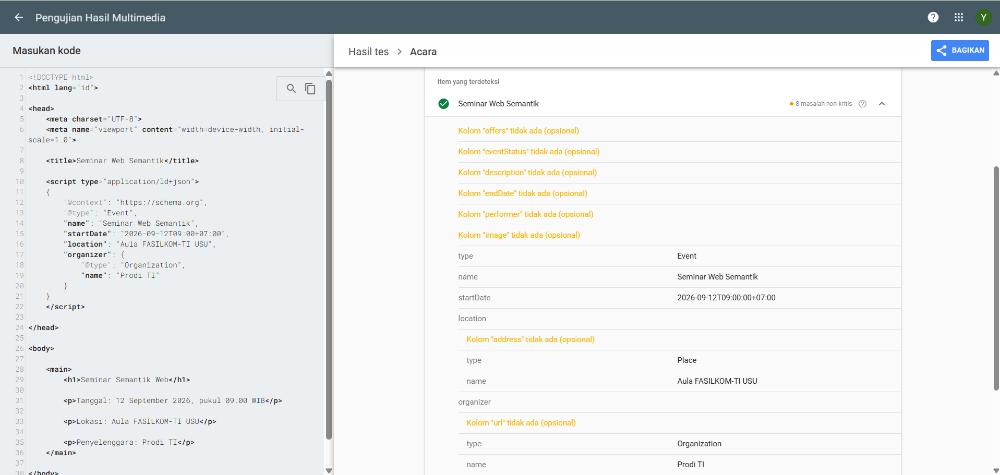

# Latihan Pertemuan 3 - JSON-LD dan Data Terstruktur

## Identitas

| No. | Nama                               | NIM       | 
| --- | ---------------------------------- | --------- | 
| 1   | **Rodotua Naomi Mutiara Simamora** | 251402030 |
| 2   | **Vedder Timothy Simbolon**        | 251402072 | 
| 3   | **Yessica Jaklin**                 | 251402001 | 
| 4   | **M. Rajadinata Nasution**         | 251402107 | 
| 5   | **Daradira Vonna**                 | 251402026 | 

## Struktur

- `profil-saya.jsonld`
- `pertemuan-03/seminar.html`
- `seminar.html`
  - tangkapan layar

## 1. JSON Biasa dan JSON-LD

1. Perbedaan fungsi: ...
2. `@context`, `@type`, dan `@id`: ...
3. Node tanpa `@id`: ...

## 2. Peran schema.org

1. Alasan memilih tipe paling spesifik: ...
2. Nama properti dan bahasa alami: ...
3. Rangkuman format pada Rich Result: ...

## 3. Perbaikan Lima Kesalahan

| No | Bagian Salah | Alasan | Perbaikan |
|----|--------------|--------|-----------|
| 1 | "person" | Tipe di Schema.org menggunakan huruf kapital | "@type": "**Person**" |
| 2 | 'name' | JSON-LD harus menggunakan tanda kutip ganda | **"name"**: "Rina Anggraini" |
| 3 | "12 September 2004" | Penulisan tanggal wajib menggunakan format tanggal ISO 8601 | "birthDate": "**2004-09-12**" |
| 4 | "nomorInduk" | Properti tersebut tidak terdaftar di Schema.org, harus diganti | "**identifier**": "221401001" |
| 5 | "221401001", | Koma pada properti terakhir harus dihapus karena tidak valid dalam JSON-LD | "identifier": **"221401001"** |

## 4. Tiga Kali Input dan JSON-LD Playground

### Teks

Data JSON-LD berisi lima orang, yaitu Rodotua Naomi Mutiara Simamora, Vedder Timothy Simbolon, Yessica Jaklin, M. Rajadinata Nasution, dan Daradira Vonna. Kelima orang tersebut memiliki hubungan dengan Universitas Sumatera Utara dan memiliki pengetahuan dalam bidang Pemrograman dan Web Semantik.

### Triple

1. Rodotua Naomi Mutiara Simamora → alumniOf → Universitas Sumatera Utara
2. Rodotua Naomi Mutiara Simamora → knowsAbout → Pemrograman
3. Rodotua Naomi Mutiara Simamora → knowsAbout → Web Semantik

4. Vedder Timothy Simbolon → alumniOf → Universitas Sumatera Utara
5. Vedder Timothy Simbolon → knowsAbout → Pemrograman
6. Vedder Timothy Simbolon → knowsAbout → Web Semantik

7. Yessica Jaklin → alumniOf → Universitas Sumatera Utara
8. Yessica Jaklin → knowsAbout → Pemrograman
9. Yessica Jaklin → knowsAbout → Web Semantik

10. M. Rajadinata Nasution → alumniOf → Universitas Sumatera Utara
11. M. Rajadinata Nasution → knowsAbout → Pemrograman
12. M. Rajadinata Nasution → knowsAbout → Web Semantik

13. Daradira Vonna → alumniOf → Universitas Sumatera Utara
14. Daradira Vonna → knowsAbout → Pemrograman
15. Daradira Vonna → knowsAbout → Web Semantik

### Hasil di JSON-LD Playground

JSON-LD merepresentasikan lima entitas dengan tipe `Person`. Setiap orang memiliki identitas unik menggunakan `@id`, nama menggunakan properti `name`, hubungan dengan Universitas Sumatera Utara menggunakan `alumniOf`, serta bidang pengetahuan menggunakan `knowsAbout`.

Kelima entitas tersebut digabungkan dalam satu dokumen menggunakan `@graph`.

## 5. Hasil Validasi

- Tes Hasil Lengkap: Struktur JSON-LD berhasil dibaca dan seluruh informasi profil dapat dikenali.

- Tes Schema: Data menggunakan `@context` dari schema.org dan tipe `Person` dengan properti yang sesuai.

- Tes Semantik JSON-LD: Data berhasil merepresentasikan satu entitas `Person` yang memiliki identitas melalui `@id`, hubungan dengan Universitas Sumatera Utara melalui `alumniOf`, serta beberapa bidang pengetahuan melalui `knowsAbout`.

## 6. Refleksi

### 1. Apa perbedaan fungsi Schema Markup Validator dan Rich Results Test?

Schema Markup Validator digunakan untuk memeriksa apakah struktur data terstruktur, seperti JSON-LD, sudah ditulis dengan benar sesuai standar schema.org. Validator ini dapat mendeteksi kesalahan pada properti, tipe data, maupun struktur schema yang digunakan.

Sedangkan Rich Results Test digunakan untuk memeriksa apakah data terstruktur pada halaman web memenuhi syarat untuk ditampilkan sebagai rich results di Google. Jadi, sebuah JSON-LD dapat saja valid secara struktur pada Schema Markup Validator, tetapi belum tentu memenuhi persyaratan untuk menghasilkan rich results.

### 2. Mengapa `@id` harus sama dengan konten yang terlihat di halaman?

`@id` digunakan sebagai identitas unik untuk suatu entitas dalam JSON-LD. Informasi yang terdapat pada data terstruktur harus sesuai dengan konten yang benar-benar terlihat di halaman agar tidak terjadi perbedaan informasi antara data untuk mesin dan data untuk pengunjung.

Dengan demikian, mesin pencari dapat memahami bahwa data JSON-LD benar-benar merepresentasikan konten pada halaman tersebut. Jika informasi JSON-LD berbeda dengan isi halaman, data tersebut dapat dianggap tidak konsisten atau menyesatkan.

## Bukti

