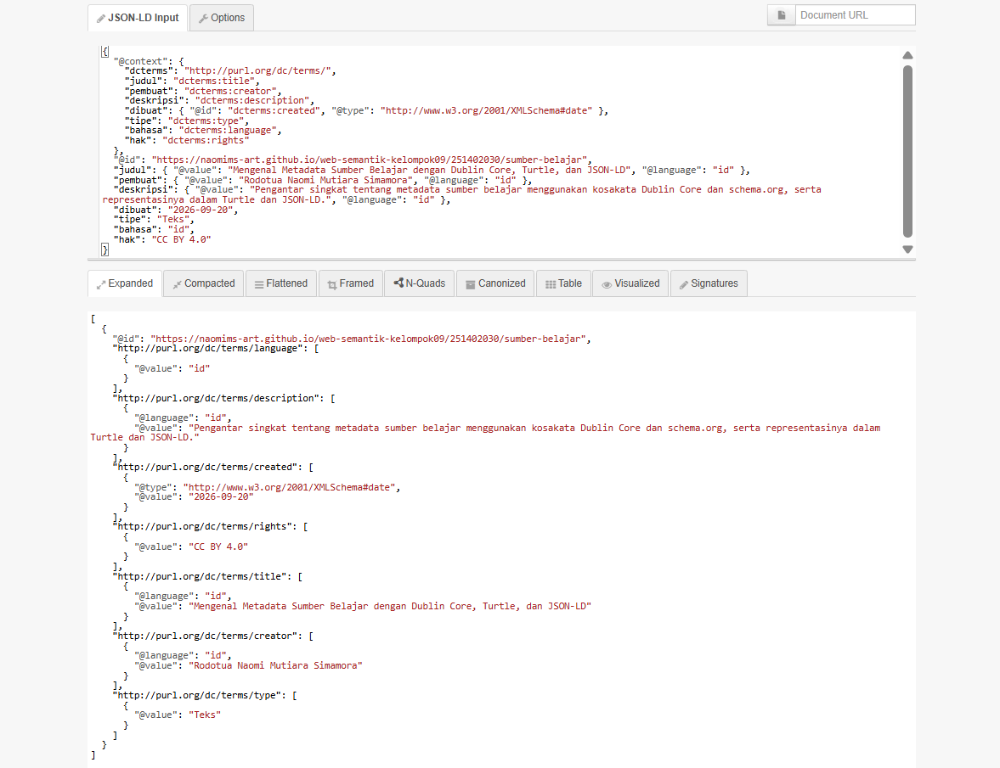
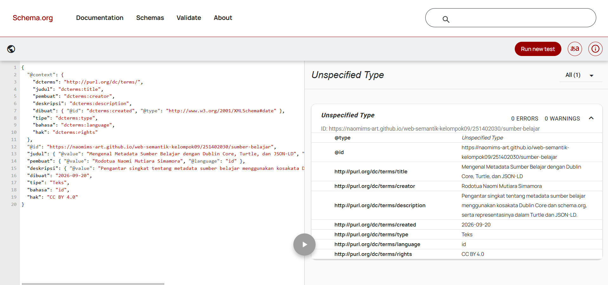

# Pertemuan 4 — Metadata dan Interoperabilitas

Tautan folder: https://github.com/NaomiMS-art/web-semantik-kelompok09/tree/main/pertemuan-04

## Identitas sumber
- Judul: Mengenal Metadata Sumber Belajar dengan Dublin Core, Turtle, dan JSON-LD
- Pembuat: Rodotua Naomi Mutiara Simamora
- Deskripsi: Pengantar singkat tentang metadata sumber belajar menggunakan kosakata Dublin Core dan schema.org, serta representasinya dalam Turtle dan JSON-LD.
- Tanggal: 2026-09-20
- URI sumber: [https://naomims-art.github.io/web-semantik-kelompok09/251402030/sumber-belajar](https://github.com/NaomiMS-art/web-semantik-kelompok09/blob/79b64a54226581c84fb87ddcb32a804e1189752c/pertemuan-04/sumber-belajar.html)
- Jenis sumber: Teks (artikel pengantar)
- Bahasa: id
- Hak: CC BY 4.0

## Pemetaan Dublin Core

| Properti | Nilai | Alasan pemilihan |
| --- | --- | --- |
| `dcterms:title` | Mengenal Metadata Sumber Belajar dengan Dublin Core, Turtle, dan JSON-LD | Properti ini digunakan untuk menunjukkan judul dari sumber belajar. |
| `dcterms:creator` | Rodotua Naomi Mutiara Simamora | Digunakan untuk mencantumkan nama pihak yang membuat dan bertanggung jawab terhadap isi sumber. |
| `dcterms:description` | Pengantar singkat tentang metadata sumber belajar menggunakan kosakata Dublin Core dan schema.org, serta representasinya dalam Turtle dan JSON-LD. | Properti ini berfungsi untuk memberikan gambaran singkat mengenai isi sumber. |
| `dcterms:created` | 2026-09-20 | Digunakan untuk menunjukkan tanggal saat sumber dibuat dengan format `YYYY-MM-DD`. |
| `dcterms:identifier` | [https://naomims-art.github.io/web-semantik-kelompok09/251402030/sumber-belajar](https://github.com/NaomiMS-art/web-semantik-kelompok09/blob/79b64a54226581c84fb87ddcb32a804e1189752c/pertemuan-04/sumber-belajar.html) | Digunakan sebagai identitas unik dari sumber dalam bentuk URI. |
| `dcterms:type` | Text | Menunjukkan bahwa sumber yang digunakan berupa teks atau artikel pengantar. |
| `dcterms:language` | id | Digunakan untuk menunjukkan bahasa yang digunakan pada sumber. Kode `id` menunjukkan Bahasa Indonesia. |
| `dcterms:rights` | CC BY 4.0 | Digunakan untuk menjelaskan lisensi atau hak penggunaan yang diterapkan pada sumber. |

**Perbedaan `dcterms:creator` dan `dcterms:publisher`:**  
`dcterms:creator` digunakan untuk menjelaskan siapa yang membuat atau menghasilkan isi sumber, sedangkan `dcterms:publisher` menunjukkan pihak yang menerbitkan atau menyebarkan sumber tersebut kepada publik. Pada sumber ini, Rodotua Naomi Mutiara Simamora berperan sebagai `creator`, sedangkan `publisher` tidak dicantumkan karena tidak terdapat pihak penerbit lain yang secara khusus disebutkan.

## Hasil validasi
- JSON-LD Playground:
   - Tidak menampilkan pesan galat merah, dan tab Expanded berhasil terisi. Artinya JSON valid dan semua istilah pada @context (judul, pembuat, deskripsi, dibuat, tipe, bahasa, hak) berhasil dipetakan ke URI dcterms:
   - Validator Schema.org : 0 errors
   - Turtle : prefix lengkap, ; dan . benar
   - Triplet : 7 triple, semuanya dengan subjek yang sama

     
- Validator Markup Skema:
  - Perbandingan HTML meta, Turtle, dan JSON-LD

| Elemen | HTML meta | Turtle | JSON-LD | Makna |
|---|---|---|---|---|
| Judul | `DC.title` | `dcterms:title` | `judul` → `dcterms:title` | Tidak berubah |
| Pembuat | `DC.creator` | `dcterms:creator` | `pembuat` → `dcterms:creator` | Tidak berubah |
| Deskripsi | `DC.description` | `dcterms:description` | `deskripsi` → `dcterms:description` | Tidak berubah |
| Tanggal | `DC.date` | `dcterms:created` | `dibuat` → `dcterms:created` | Nilai sama (2026-09-20), properti HTML sedikit berbeda |
| Bahasa | `DC.language` | `dcterms:language` | `bahasa` → `dcterms:language` | Tidak berubah (`id`) |
| Hak | `DC.rights` | `dcterms:rights` | `hak` → `dcterms:rights` | Tidak berubah (CC BY 4.0) |
| Tipe | `DC.type` | `dcterms:type` | `tipe` → `dcterms:type` | Tidak berubah (Teks) |

## Refleksi
1. Mengapa URI sama penting untuk Turtle dan JSON-LD?
   URI adalah identitas sumber. Jika URI sama, sistem lain tahu bahwa pernyataan di Turtle dan JSON-LD membicarakan satu sumber yang sama dan dapat menggabungkannya. Jika berbeda, keduanya dianggap dua sumber terpisah.
2. Apa perbedaan peran DC Terms dan Schema.org pada pekerjaan ini?
   DC Terms dipakai untuk deskripsi metadata sumber yang bersifat umum dan baku di dunia perpustakaan dan repositori (Turtle dan JSON-LD pertama). Schema.org dipakai agar sumber dikenali mesin pencari dan validator markup, dengan tipe LearningResource yang lebih spesifik untuk materi belajar.
3. Satu risiko jika metadata HTML, Turtle, dan JSON-LD tidak konsisten:
   Sistem yang mengumpulkan data bisa menemukan judul, pembuat, atau tanggal yang saling bertentangan, sehingga sulit menentukan mana yang benar. Sumber bisa salah tercatat atau gagal digabungkan dengan data lain.

## Catatan akhir
Metadata sumber ini konsisten di HTML, Turtle, dan JSON-LD. Judul, pembuat, deskripsi, tanggal (2026-09-20), jenis (Teks), bahasa (id), dan lisensi (CC BY 4.0) bernilai sama di semua file, dan isi halaman `sumber-belajar.html` sejalan dengan metadata di bagian `head`. Turtle dan JSON-LD memakai URI subjek yang sama, sehingga keduanya menghasilkan graf RDF yang setara. Berkas `metadata-schema.jsonld` memakai kosakata schema.org (LearningResource) untuk sumber dan URI yang sama, dengan pemetaan `name`, `description`, `inLanguage`, `dateCreated`, dan `license`. Bentuk penulisannya berbeda: lisensi di skema ditulis sebagai URL CC BY 4.0, sedangkan di DC berupa teks "CC BY 4.0", tetapi maknanya sama.
